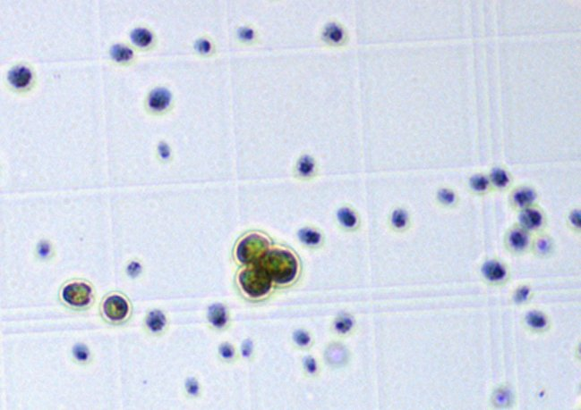
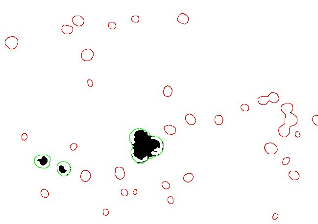
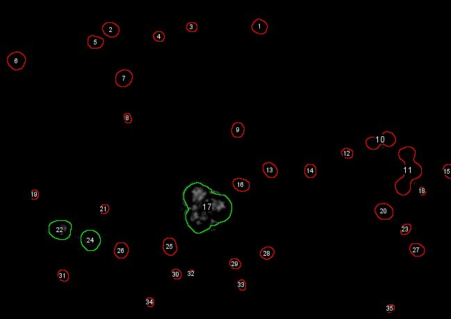
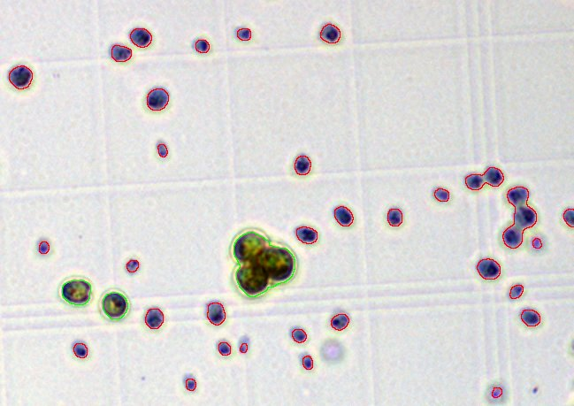

# ParticleArea
This macros allows quantification of celle death in plant cells stained with Evans Blue. 
Exanples with Chlamydomonas cells.

## Original

## Threshold

## Continuous

## Results Table
Results are tidy! 