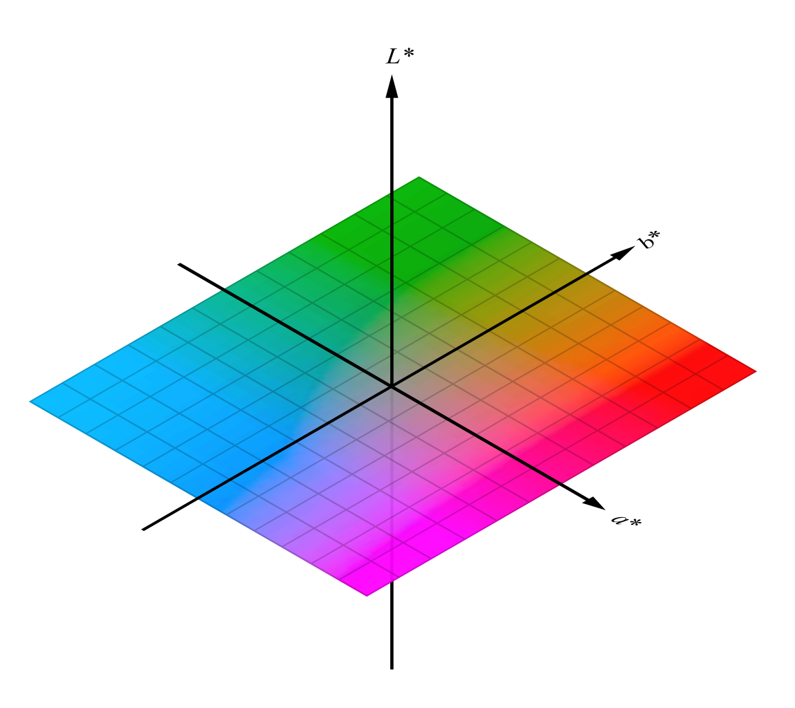
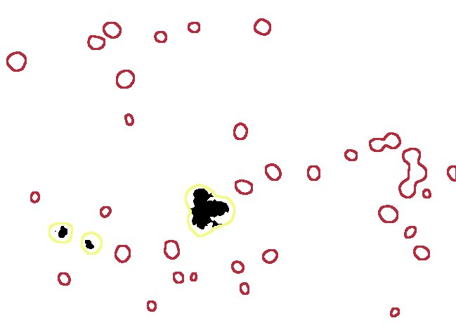
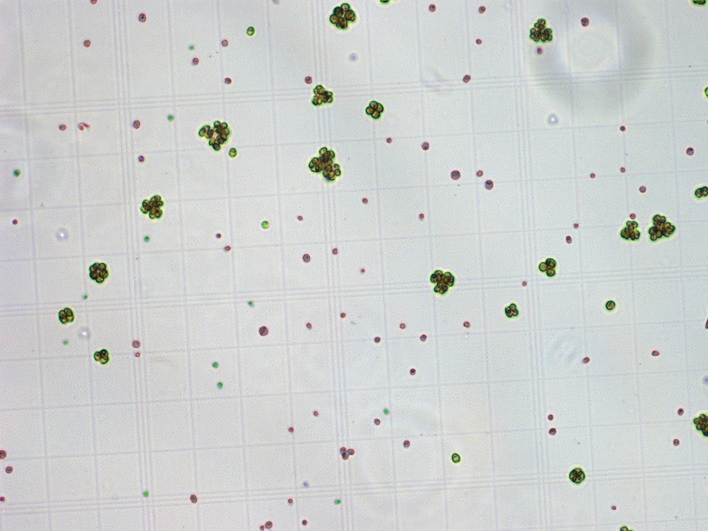
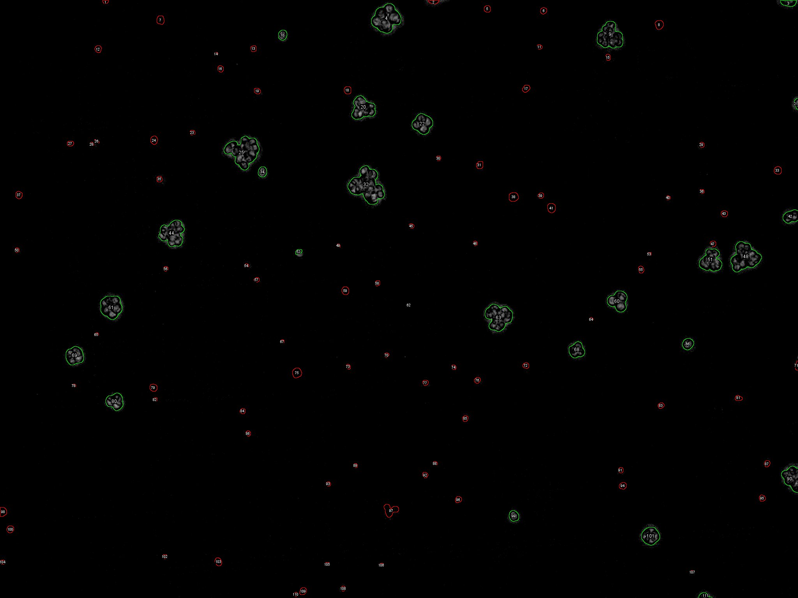
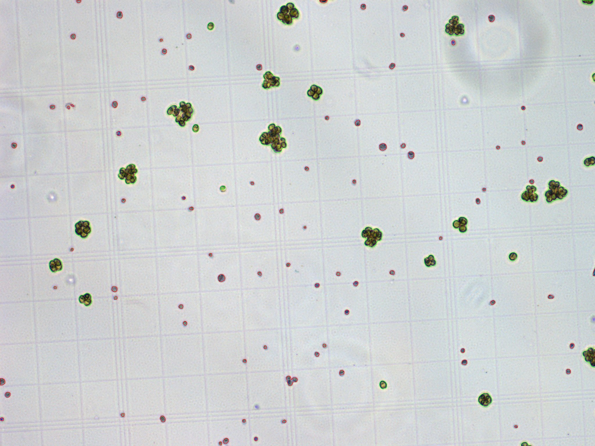

# PlantDeath
This macros allows quantification of cell death in plants stained with Evans Blue.
Examples with Chlamydomonas cells. 
It is based on the transformation from RGB to CIE L\*a\*b\* images and selection of the b* channel. 

IT ONLY WORKS WITH FIJI, NOT IMAGE J.

## Original

## Threshold

## Continuous

## Results Table
Results are tidy! 