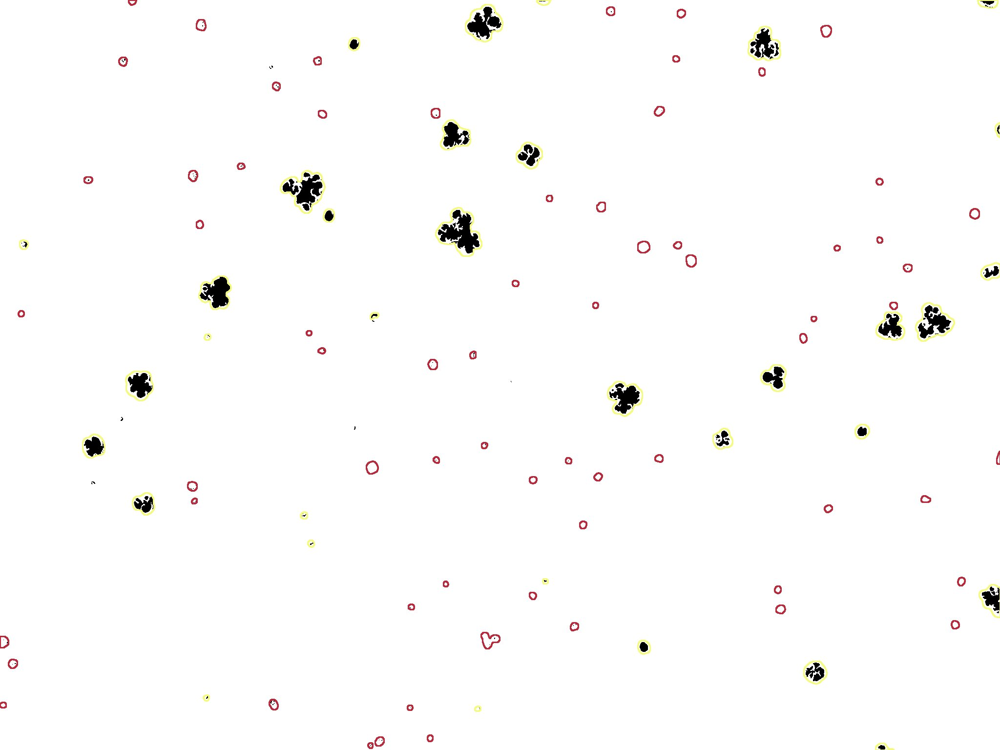

# PlantDeath
**IT ONLY WORKS WITH FIJI, NOT IMAGEJ**
- This macros allows quantification of cell death in plants stained with Evans Blue.
- It is based on the transformation from RGB to CIE L\*a\*b\* images. 

- The dead cells are stained in blue while the living cells remains green. 
It is therfore possible to discimiate them based on theire b\* value. 
- The user can chose options: white balance ([original macro](https://github.com/pmascalchi/ImageJ_Auto-white-balance-correction)), whatersheding, scale and minimum area. 
- Examples with Chlamydomonas cells. 

## Original

## Threshold

## Continuous

## Results Table
Results are tidy! 