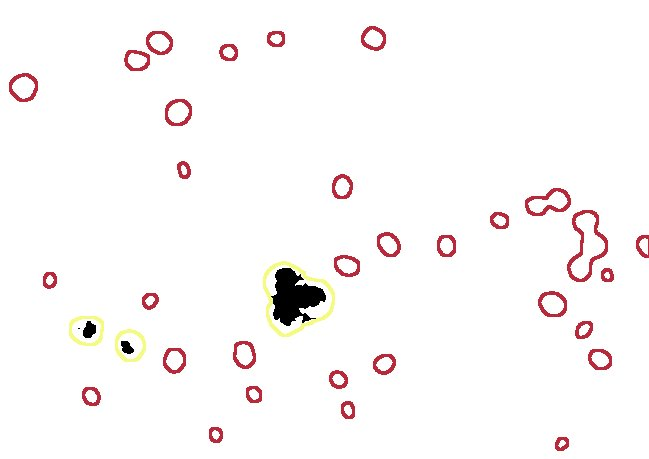
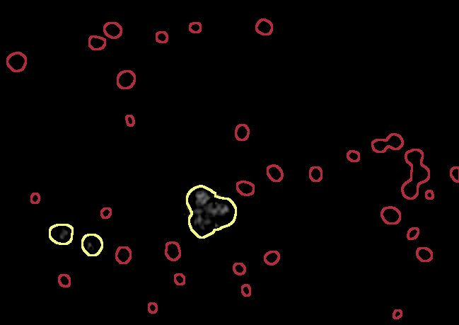

# PlantDeath
**IT ONLY WORKS WITH FIJI, NOT IMAGEJ**
-This macros allows quantification of cell death in plants stained with Evans Blue.
-It is based on the transformation from RGB to CIE L\*a\*b\* images. 

-The dead cells are stained in blue while the living cells remains green. 
It is therfore possible to discimiate them based on theire b\* value. 
-The user can chosse options: white balance ([original macro](https://github.com/pmascalchi/ImageJ_Auto-white-balance-correction)), whatersheding, scale and minimum area. 
-Examples with Chlamydomonas cells. 

## Original

## Threshold

## Continuous

## Results Table
Results are tidy! 